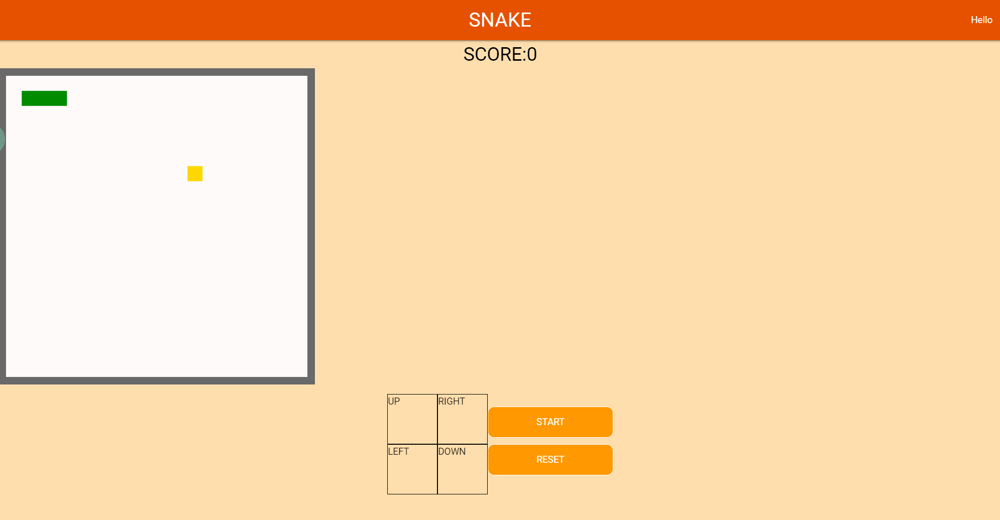
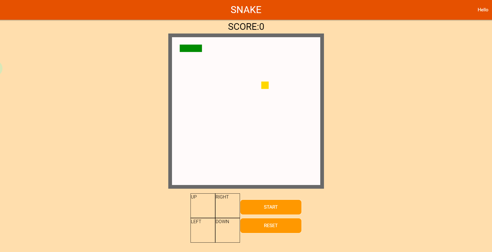
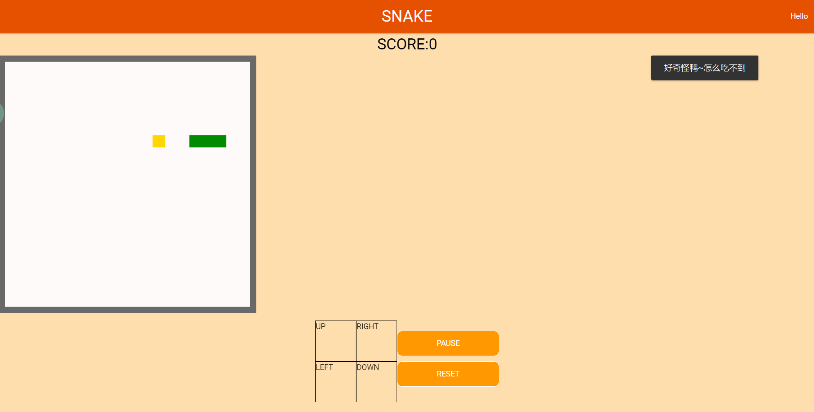
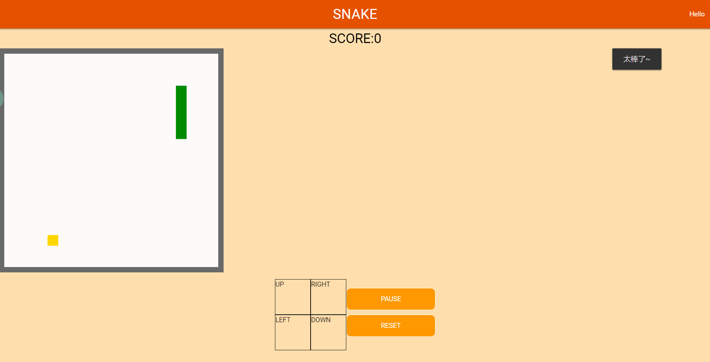
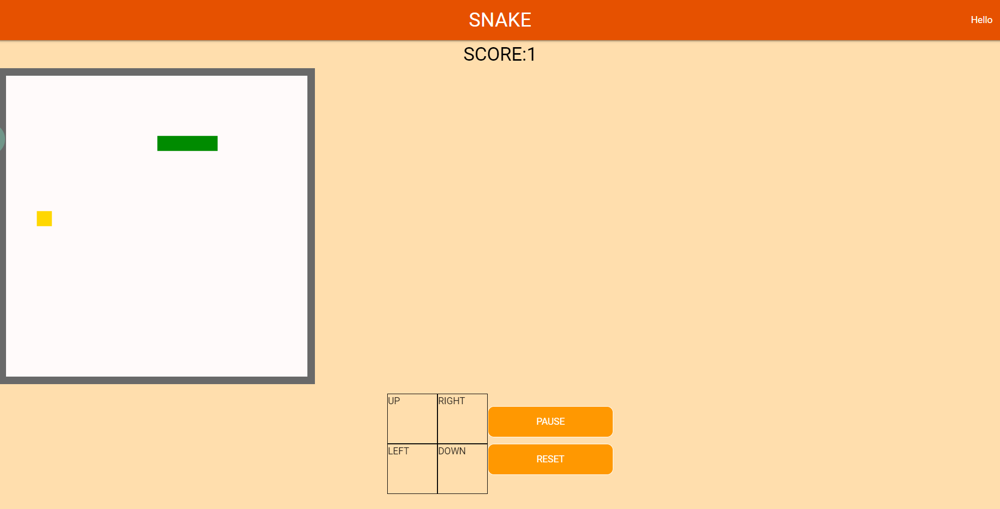
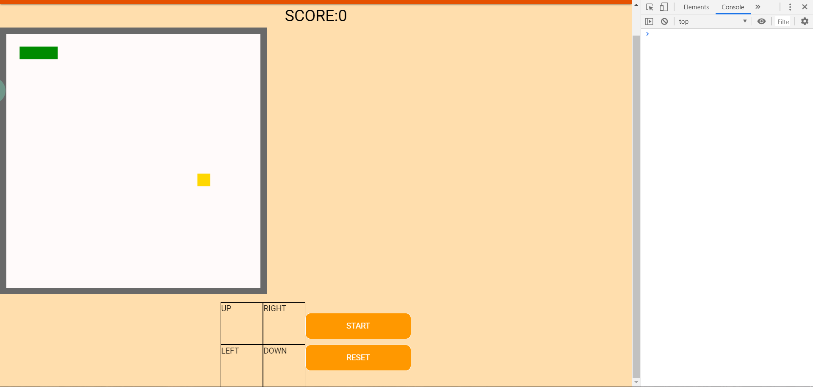
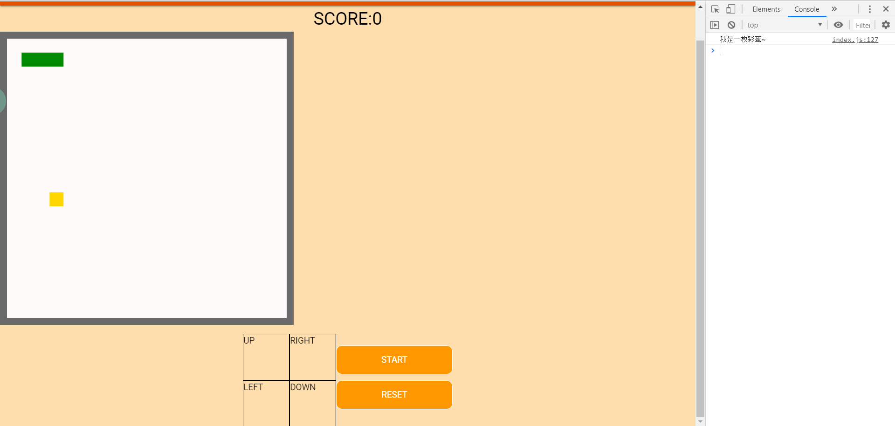
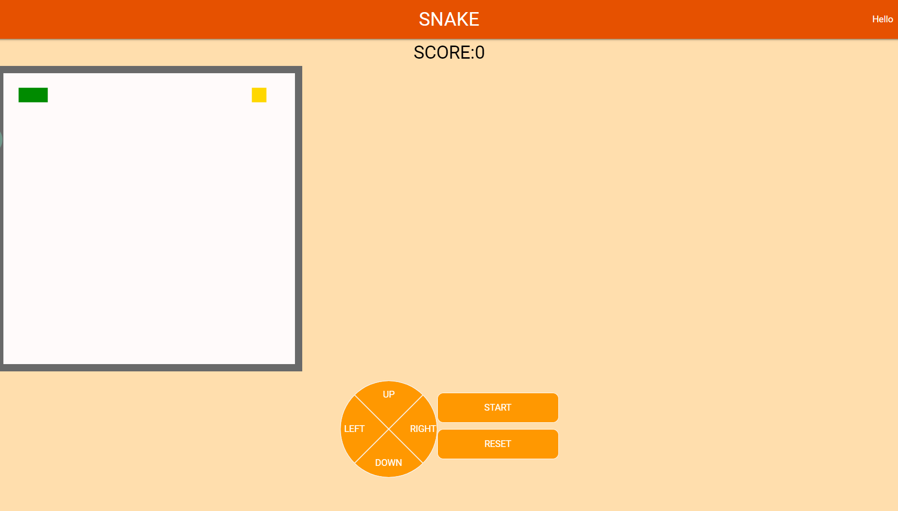

##  来试试完善“贪吃蛇”吧~

欢迎各位19级学弟学妹来尝试我们校科协前端组的试题鸭，漫长又无聊的假期总要找点乐子嘛，突然，暑假闲着无事可做的陈同学想到了一个好主意，开发一个可供多人同时游玩的贪吃蛇，和朋友一起玩，那一定很有趣吧。说干就干，经过一顿操作，陈同学终于部署好了线上版本。可是当他想和他的好朋友一起快乐时，突然发现了BUG！这是怎么回事？机智的陈同学经过查看修改时间，发现居然有人通过某种不知名手段半夜删他代码！这可急坏了陈同学，可是这个时候陈同学突然接到了锅，作为乙方自然是不能怠慢了甲方爸爸，但是这边已经完成了大半的贪吃蛇也不能落下。于是，他想到了聪明的你，相信你一定能够将这些小BUG斩于马下，帮他完成这个项目！

## 目标

完成所有必做项及任意两个选做项即可完成免试题，当然聪明的你也可以选择继续完成哟~
* 【必做】目前显示游戏内容的画布处于网页左端，这可太影响体验了，用户体验也是前端的一门大学问呢，希望你能将整个画布移动到视角中央哦。

  
  
  <center>目前状态</center>
  

<center>完成状态</center>
* 【必做】可恶啊，不知道被删了哪段代码，小蛇吃到食物后长度居然不会增加了，也没有新的食物产生了。聪明的你能修复这个BUG吗？

  
  
  <center>目前状态</center>
  

<center>完成状态</center>
* 【必做】小蛇好不容易吃到了食物，却不知道拿到了多少分数，让分数显示出来，获得满满的成就感吧！（提示：分数与小蛇长度挂钩哦，所以不完成上面的题目，分数是不会增加的）

  
  
  <center>目前状态</center>
  

<center>完成状态</center>
* 【选做五选二】看来你已经修复了一大部分啦，加油鸭，胜利近在咫尺，现在就在控制台里加上自己想说的话吧~（彩蛋）

  
  
  <center>目前状态</center>
  
  
<center>完成状态</center>
* 【选做五选二】哇，就连控制小蛇移动方向的按键的样式都被删了，这么丑的页面可不会有人来玩鸭，发挥你的想象力，尽可能的把这些按键变得漂亮些吧~（可以自由发挥哦）

  
  
  <center>目前状态</center>
  
  
<center>完成状态</center>
* 【选做五选二】只有上下左右方向键能控制小蛇移动，这可不能满足“职业玩家”鸭，让W A S D四个按键也能控制小蛇移动吧，因为你就是“职业玩家”！
* 【选做五选二】诶，重置游戏的按钮失效了，每次要重新开始都要刷新页面好麻烦啊，你能让它恢复正常吗？
* 【选做五选二】哇，现在基本所有功能都实现啦，但是有一个小问题：小蛇每次游戏开始时出现的位置是固定的，而且长度有点短。你能弥补这个小瑕疵，让小蛇的初始长度变为4 ，并且出现在随机位置吗？（提示：有一定难度）

## 文件结构

```
.
├── README.md           帮助文件
├── fonts              字体相关的资源文件
│   └── roboto
│       ├── Roboto-Bold.woff
│       ├── Roboto-Bold.woff2
│       ├── Roboto-Light.woff
│       ├── Roboto-Light.woff2
│       ├── Roboto-Medium.woff
│       ├── Roboto-Medium.woff2
│       ├── Roboto-Regular.woff
│       ├── Roboto-Regular.woff2
│       ├── Roboto-Thin.woff
│       └── Roboto-Thin.woff2
├── index.html        贪吃蛇游戏的主页,我们可能需要修改的地方
├── lib               这个项目的引用的库,一般不需要我们修改,也不需要看
│   ├── animate.css
│   ├── jquery.js
│   ├── materialize-icon.css
│   ├── materialize.css
│   └── materialize.js
└── src               这个项目的其他一些源代码,我们主要修改这个文件夹里的东西
    ├── css  
    │   └── index.css
    └── js
        └── index.js


```

## 如何提交

私戳前端组的三位讲师都可以哟，我们的QQ分别是：

* 周灿：474504964
* 陈凯森：749923710
* 陈志帆：1103452257

## 如果想完成这些，我大概需要学习什么

   * HTML基础知识

   * CSS基础知识

   * JavaScript基础知识

   * Chrome的开发者工具（DevTools）的使用

## 可能需要的参考资料

HTML与CSS是网页开发的基础，简单易上手，下面的教程会帮助你快速掌握必备的基础知识，前两个是文档类型，第三个是MOOC上的免费网课，能够自己动手实践，学习效率较高。

*  HTML基础知识：http://www.w3school.com.cn/html/html_jianjie.asp

* CSS基础知识：http://www.w3school.com.cn/css/index.asp

* HTML+CSS基础课程：https://www.imooc.com/learn/9

接下来就是前段开发的重中之重：JavaScript，初次接触这类语言可能有些难度，但本次试题仅用到了最基础的知识，相信你一定能够学会哦！

* JavaScript基础：http://www.w3school.com.cn/js/index.asp     https://www.imooc.com/learn/10

另外，用好浏览器的开发者工具（DevTools）也是前端工程师的必备技能哦，在这里我们只推荐 Chrome 浏览器，因为具有较好的兼容性，速度快，DevTools优秀且强大，下面附上下载地址以及 DevTools 的使用方法：

* Chrome 下载地址：https://www.google.com/intl/zh-CN/chrome/

* DevTools      介绍：<https://developers.google.com/web/tools/chrome-devtools/?hl=zh-cn>

 有什么其他问题欢迎私戳三位讲师哦~~~

## 我如何在本地编写我的代码

在此我们只推荐了Visual Studio Code，它是一款免费开源的现代化轻量级代码编辑器，支持几乎所有主流的开发语言的语法高亮、智能代码补全、自定义快捷键、括号匹配和颜色区分、代码片段、代码对比 Diff、GIT命令等特性，支持插件扩展，并针对网页开发和云端应用开发做了优化，是前端开发的利器。